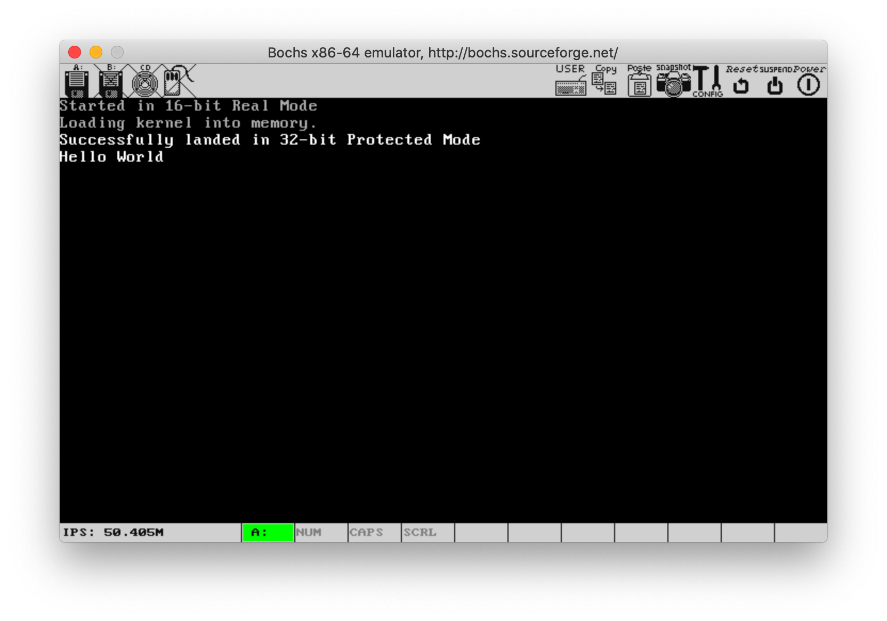

# 从零开始实现一个简单操作系统

目的：了解操作系统底层原理

### 运行
需要安装 bochs 虚拟机，然后执行 `make run`

### 已完成的

1.  实模式切换到保护模式
2.  加载内核程序
3.  屏幕驱动（打印字符）

### 下一步

保护模式中断

### 参考资料

https://www.cs.bham.ac.uk/~exr/lectures/opsys/10_11/lectures/os-dev.pdf

